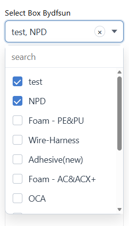
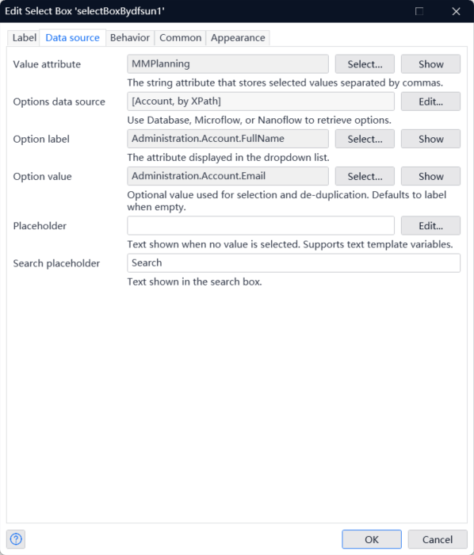
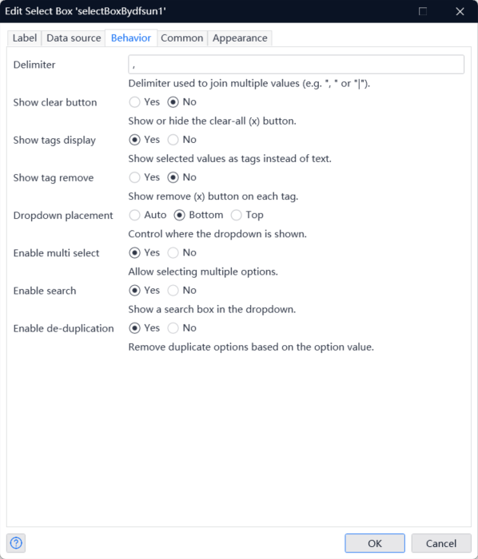

## SelectBoxBydfsun
Multi-select dropdown widget for Mendix with datasource support, search, de-duplication, and custom delimiter.

## Screenshot

Interface display, supports search.
支持搜索，单选多选，去重，多选支持自定义符合分隔，




## Features
- Multi-select with comma-separated storage in a string attribute
- Database / Microflow / Nanoflow list datasource
- Optional de-duplication based on value
- Built-in search
- Custom delimiter
- Dropdown placement control (auto / bottom / top)

## Requirements
- Mendix Studio Pro (web)
- Node.js >= 16 for building

## Installation
1. Build the widget.
```
npm install
npm run build
```
2. Import the generated `.mpk` from the `dist` folder into your Mendix project.

## Configuration
### Data source
- `Value attribute`: String attribute that stores selected values (joined by delimiter)
- `Options data source`: List datasource (Database / Microflow / Nanoflow)
- `Option label`: String attribute displayed in the dropdown
- `Option value`: Optional value used for selection and de-duplication (defaults to label)

### Behavior
- `Delimiter`: String used to join multiple values, default `", "`
- `Enable multi select`: Enable or disable multi-select
- `Enable search`: Show or hide the search box
- `Enable de-duplication`: Remove duplicate options by value
- `Dropdown placement`: Auto / Bottom / Top

## Properties (Quick Reference)
| Group | Property | Type | Required | Default | Description |
| --- | --- | --- | --- | --- | --- |
| Data source | Value attribute | String attribute | Yes | - | Stores selected values joined by delimiter |
| Data source | Options data source | Datasource (list) | Yes | - | Database / Microflow / Nanoflow |
| Data source | Option label | String attribute | Yes | - | Text shown in dropdown |
| Data source | Option value | Attribute | No | - | Value used for selection and de-duplication |
| Data source | Placeholder | String | No | - | Placeholder when empty |
| Data source | Search placeholder | String | No | - | Placeholder for search box |
| Behavior | Delimiter | String | No | `", "` | Join selected values |
| Behavior | Dropdown placement | Enumeration | Yes | `auto` | `auto`, `bottom`, `top` |
| Behavior | Enable multi select | Boolean | No | `true` | Allow multiple selections |
| Behavior | Enable search | Boolean | No | `true` | Show search input |
| Behavior | Enable de-duplication | Boolean | No | `true` | Remove duplicate options by value |

## Value format
Selections are stored as a single string joined by the configured delimiter.
Example with delimiter `", "`:
```
Security, Private Cloud, Data
```

## Example use cases
- Tag selection
- Feature toggles
- Permissions and roles
- Category filters

## Development
1. Install dependencies.
```
npm install
```
2. Start dev server.
```
npm run dev
```
3. Build for release.
```
npm run build
```

## Notes
- If you change `src/SelectBoxBydfsun.xml`, rebuild so typings and bundle are regenerated.
- The widget stores values in a String attribute for maximum compatibility.

## Issues and contributions
If you find a bug or have a feature request, open an issue or PR on GitHub.
